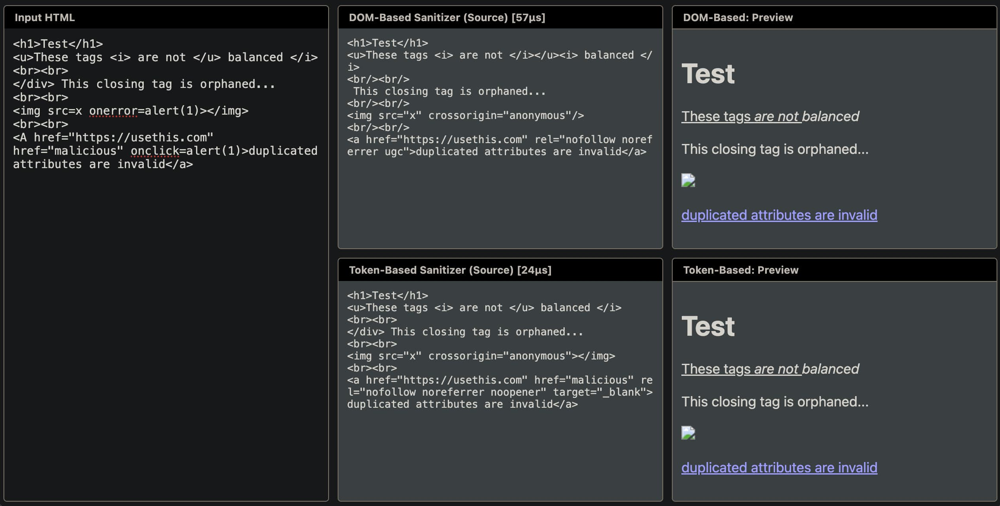

# Go HTML sanitizer

[](https://pkg.go.dev/badge/github.com/empijei/go-html-sanitizer)
[](https://goreportcard.com/report/github.com/empijei/go-html-sanitizer)

A DOM-based Go HTML sanitizer. If you allow users to provide arbitrary inputs that
you render in your web page, you likely need this sanitizer.

## Table of Contents

- [Overview](#overview)
- [Installation](#installation)
- [Usage](#usage)
  - [Safe Markup Allowlist](#safe-markup-allowlist)
  - [Strict Mode](#strict-mode)
  - [Custom Policies](#custom-policies)
- [Advanced Features](#advanced-features)
  - [Policy Composition](#policy-composition)
  - [Style Attribute Sanitization](#style-attribute-sanitization)
  - [Inspection and Error Handling](#inspection-and-error-handling)
- [Threat Model and Security](#threat-model-and-security)
- [Comparison](#comparison)
  - [Features](#features)
  - [Performance](#performance)
- [Playground](#playground)

## Overview

This sanitizer allows to declare policies that mutate user-provided HTML into trusted
markup that can safely be embedded into a web page.

Unlike other available sanitizers, it understands the DOM instead of just tokenizing
HTML as a string.

This is the safest (and possibly the only safe way) to sanitize HTML.

Broken or unbalanced inputs will still yield correct HTML as an output,
ruling out a broader spectrum of attack vectors due to parsing differentials or early tag termination.

For example, let's say you have an HTML template such as the following:

```html
<div class="user-content">{{.UserContent}}</div>
```

With other sanitizers, inputs like `</div>_injection_` would break out of the `user-content` class
and potentially inject markup where you don't intend users to be able to do so:

```html
<div class="user-content"></div>_injection_</div>
```

This sanitizer prevents such attacks transforming the result as follows:

```html
<div class="user-content">_injection_</div>
```

## Installation

```bash
go get github.com/empijei/go-html-sanitizer
```

## Usage

The simplest way to use it is to leverage the builtin policies.

### Safe Markup Allowlist

```go
import "github.com/empijei/go-html-sanitizer/policies"

// The UserGeneratedContent policy comes with generally safe allowlists such as
// text formatting, table, images, but it will block all scripts, event handlers,
// dangerous tags and styles.
//
// It can be further modified if needed and it's safe for concurrent use.
var ugcp = policies.UserGeneratedContent()

func Sanitize(untrusted string)(trusted string){
	return ugcp.SanitizeString(untrusted)
}
```

Example user-generated content policy effects:

| Title                                           | Input                                          | Output                                                     |
| :---------------------------------------------- | :--------------------------------------------- | :--------------------------------------------------------- |
| Removes event handlers, adds privacy attributes | `</img>`           | ``                   |
| Allows harmless tags                            | `<h1>Test</h1>`                                | `<h1>Test</h1>`                                            |
| Balances tags                                   | `<u>These tags <i> are not </u> balanced </i>` | `<u>These tags <i> are not </i></u><i> balanced </i>`      |
| Removes orphaned tags                           | `</div> This closing tag is orphaned...`       | ` This closing tag is orphaned...`                         |
| Strips duplicated attributes                    | `<a href="a" href="b">duplicated</a>`          | `<a href="a" rel="nofollow noreferrer ugc">duplicated</a>` |

### Strict Mode

The empty policy is the safest policy, and it blocks all tags and all markup:

```go
import "github.com/empijei/go-html-sanitizer/sanitize"

var policy = &sanitize.Policy{
    // Nothing is allowed
}

func Example(){
	got := policy.SanitizeString(`prefix <a href="javascript:void(0)">link text</a>`+
     ` suffix<!--comment-->`)
    fmt.Println(got) // prefix link text suffix
}
```

### Custom Policies

Advanced users might specify very expressive policies via the available API, which supports:

- custom URI sanitizers
- `style` attributes tokenization and allowlisting
- attribute list modifiers
- tag removers and replacers
- strict allowlists for tags that must appear with specific attributes

```go
import "github.com/empijei/go-html-sanitizer/sanitize"

var policy = &sanitize.Policy{
	Allow: sanitize.Filter{
		"a": { // Allow "a"
			"rel": nil, // Optionally allow "a.rel".
		},
	},
	Must: sanitize.Modifier{
		"a": {
            "href": nil, // Allow "a.href" and make sure "a" is only allowed if it has an "href" attribute.
        },
	},
	URIs: policies.NewURIs(), // Allow safe URIs
	ModifyAttributes: sanitize.Modifier{
		"a": {func(_ string, attrs *[]html.Attribute) {
			// Always add a.rel with value of nofollow.
			*attrs = append(*attrs, html.Attribute{
				Key: "rel", Val: "nofollow",
			})
		}},
	},
}

func Example(){
	got := policy.SanitizeString(`prefix <a href="/foo">link text</a> suffix`)
    fmt.Println(got) // prefix <a href="/foo" rel="nofollow">link text</a> suffix
}
```

Please see the full policy documentation [on pkg.go.dev](https://pkg.go.dev/github.com/empijei/go-html-sanitizer/sanitize#Policy).

## Advanced Features

### Composition

Filters can be combined using `Relax` (OR) and `Restrict` (AND) operations:

```go
// Match what is matched by either filter.
filterA.Relax(filterB)

// Match what is matched by both filters.
filterA.Restrict(filterB)

// Only allow what is allowed by both policies.
// (This doesn't affect Must or Replace).
policyA.Allow.Restrict(policyB.Allow)
```

### Style Attribute Sanitization

This library provides a unique `StyleAttribute` modifier that tokenizes CSS and allows fine-grained filtering:

```go
myStyleModifier := sanitize.StyleAttribute(func(tag sanitize.TagName, style sanitize.StyleToken) (keep bool) {
    if style.Important {
        return false // Disallow !important
    }
    switch style.Property {
    case "color", "font-size":
        return true // Only allow specific properties
    }
    return false
})

p := &sanitize.Policy{
	Allow: sanitize.Filter{
		sanitize.AllTags: {"style": nil}, // Allow all style attributes.
	},
	ModifyAttributes: sanitize.Modifier{
        // Modify all style attributes with our modifier.
		sanitize.AllTags: { myStyleModifier },
	},
}
```

Please see the full policy documentation [on pkg.go.dev](https://pkg.go.dev/github.com/empijei/go-html-sanitizer/sanitize#StyleAttribute).

### Inspection and Error Handling

By default, for security reasons, the sanitizer never returns an error and never panics,
even if user-provided modifiers or matchers panic.

If something goes wrong it returns the empty string.

If you need to know if errors occurred during sanitization:

```go
err := policy.SanitizeInspect(dst, src, func(msg string, err error) {
    log.Printf("Sanitizer message: %s, error: %v", msg, err)
})
```

## Threat Model and Security

This library is designed to protect against Cross-Site Scripting (XSS) and other HTML-based attacks by:

1.  **DOM-based Parsing**: It uses `golang.org/x/net/html` to parse HTML into a DOM tree. This eliminates "mutation XSS" (mXSS) caused by differences between how a sanitizer and a browser parse HTML or content injection due to unbalanced tags.
2.  **Strict Allowlisting**: By default, everything is forbidden. You must explicitly allow tags and attributes.
3.  **URI Validation**: It provides helpers to ensure `href`, `src`, and other URI-containing attributes use safe protocols (e.g., forbidding `javascript:` or `http:`).
4.  **Attribute Normalization**: It removes duplicated attributes and can automatically add security-hardening attributes like `rel="noopener"`.

**Note**: This library does not protect against Denial of Service (DoS) attacks via extremely large inputs. You should always limit the size of the input you pass to the sanitizer.

## Comparison

### Features

| Feature                              | BlueMonday | Sanitize |
| :----------------------------------- | :--------: | :------: |
| Customizable policies                |     ✅     |    ✅    |
| Strips harmful attributes            |     ✅     |    ✅    |
| Strips harmful tags                  |     ✅     |    ✅    |
| Adds security and privacy attributes |     ✅     |    ✅    |
| Customizable attribute modifiers     |     ❌     |    ✅    |
| Balances tags                        |     ❌     |    ✅    |
| Removes spurious tags                |     ❌     |    ✅    |
| Removes duplicated attributes        |     ❌     |    ✅    |
| Removes invalid HTML tags            |     ❌     |    ✅    |
| Fast, unambiguous matchers           |     ❌     |    ✅    |
| Arbitrary Go code for policies       |     ❌     |    ✅    |
| Style attribute tokenizer            |     ❌     |    ✅    |

### Performance

**Summary**: While Sanitize offers a safer, more customizable API that performs better with medium
and large inputs, bluemonday is slightly faster and uses slightly less memory
(albeit with more allocations) with very small inputs.

Evaluated on a Apple M4 Pro CPU.

| Inputs | Size  |
| ------ | ----- |
| Large  | 14 MB |
| Medium | 14 KB |
| Small  | 1 KB  |

### Time per operation

~6% Faster (slightly slower on small inputs).

| Input   | BlueMonday | Sanitize | Sanitize VS BlueMonday |
| ------- | ---------- | -------- | ---------------------- |
| Large   | 215.6m     | 190.9m   | -11.46%                |
| Medium  | 149.9µ     | 136.3µ   | -9.07%                 |
| Small   | 12.33µ     | 12.78µ   | +3.62%                 |
| geomean | 735.9µ     | 692.7µ   | -5.86%                 |

### Bytes allocated per operation

~38% More memory used (higher cost on small inputs, less impactful on large inputs).

| Input   | BlueMonday | Sanitize | Sanitize VS BlueMonday |
| ------- | ---------- | -------- | ---------------------- |
| Large   | 145.8Mi    | 166.3Mi  | +14.03%                |
| Medium  | 120.5Ki    | 145.0Ki  | +20.37%                |
| Small   | 9.516Ki    | 18.167Ki | +90.92%                |
| geomean | 555.3Ki    | 765.5Ki  | +37.87%                |

### Allocations per operation

~55% Fewer allocations (always allocates fewer times).

| Input   | BlueMonday | Sanitize | Sanitize VS BlueMonday |
| ------- | ---------- | -------- | ---------------------- |
| Large   | 5.067M     | 1.901M   | -62.48%                |
| Medium  | 3.370k     | 1.382k   | -58.99%                |
| Small   | 304.0      | 176.0    | -42.11%                |
| geomean | 17.32k     | 7.733k   | -55.34%                |

## Playground

This module comes with a playground (`go run ./playground`) that allows you to
experiment with your policy to see how it works, and compare it with tokenizer-based
sanitizers like bluemonday.


